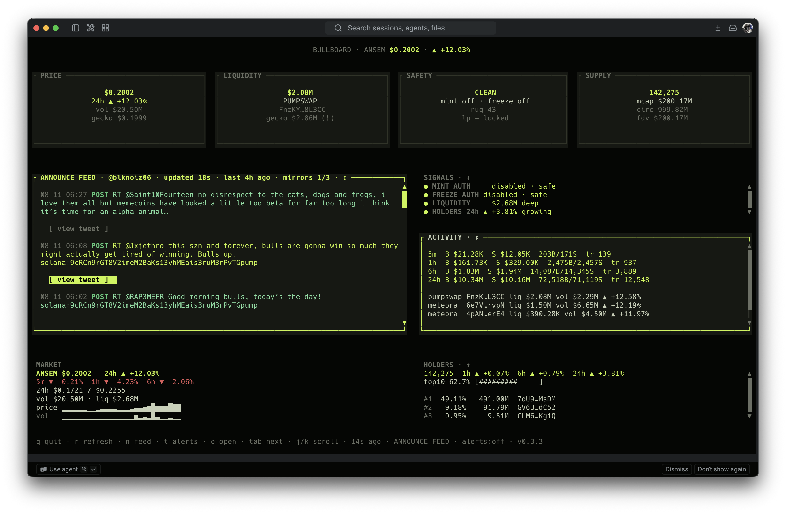

<div align="center">

# ⬢ bullboard

**A friendly terminal dashboard for `$ANSEM` + `@blknoiz06`** — watch the price and keep up with the tweets, right from your own computer.




</div>

---

## What is this?

bullboard is a small program that lives in your terminal and shows you two things at a glance:

- **the `$ANSEM` price** — with volume, holders, liquidity, and safety signals
- **`@blknoiz06`'s latest tweets** — usually within ~30 seconds of posting

Think of it as a little stock ticker for a meme coin, with a Twitter feed attached. It's inspired by the Surfboard / MAXPANE dashboards.

## The reassuring part — what it does and doesn't do

- **It runs on your computer.** There is no server. Nothing gets deployed anywhere, nothing runs in the cloud.
- **It only reads public data** — the same public pages and APIs your browser already talks to. It never sends anything about *you* anywhere.
- **No accounts, no passwords, no API keys.** Not even a config file — it just works out of the box.
- **It can't post anything.** It only ever fetches. It's a window, not a bot.
- **You can quit anytime with `q`.** It won't change anything on your system beyond what you launched.

If you can run a terminal, you can run this. The mouse works, too.

## Quick start

**One command to install:**

```bash
cargo install --git https://github.com/Bull-Inference/bullboard
```

**One command to run:**

```bash
bullboard
```

That's it. `q` quits, the mouse and keyboard both work, and everything refreshes by itself.

*(Prefer the old Python version? It's still around in `legacy-python/` — but the Rust version above is the one that's maintained.)*

## What you'll see

Nine panes on one screen — price and 24h change up top, then:

| Pane | What it tells you |
|------|-------------------|
| Gate / Treasury / Audit | Price flow, liquidity, and whether the token contract is safe (mint/freeze off) |
| Mcap / Supply | Holders, market cap, circulating supply |
| **Announce feed** | `@blknoiz06`'s tweets, newest first — click or press `o` to open one |
| Signals | Plain-English health checks: is liquidity deep? are top holders concentrated? |
| Activity | Buy/sell volume and DEX pair flow |
| Market / Holders | Sparklines and holder distribution |

## Keys — the short version

| Key | Action |
|-----|--------|
| `q` / `Esc` | quit |
| `r` | refresh everything now |
| `n` | refresh the tweet feed now |
| `t` | toggle desktop notifications when he posts |
| `Tab` | move to the next pane |
| `↑` `↓` / `j` `k` | scroll the pane you're in |
| `Enter` / `o` | open the tweet under the cursor |
| `1`–`9` | jump straight to a pane |
| mouse | hover highlights, click focuses, wheel scrolls |

## Tweaks (all optional)

Every setting below is a no-config default that you *can* change — most people never touch any of them.

| Var | Default | What it does |
|-----|---------|--------------|
| `BULLBOARD_X_HANDLE` | `blknoiz06` | Whose tweets to show |
| `BULLBOARD_MINT` | ANSEM | Which token to track |
| `BULLBOARD_NOTIFY` | `0` | `1` = desktop notification when he posts |
| `BULLBOARD_FEED_SECS` | `30` | How often the tweet feed checks for new posts |
| `BULLBOARD_FRESH_FEED` | `1` | `1` = live tweets (~30s). `0` = gentler cached mode (mirrors cache RSS for ~10 min, so tweets arrive slower — use this only if a mirror is grumpy with you) |
| `BULLBOARD_MIRRORS` | built-in list | Comma-separated list of tweet mirrors to use instead |
| `BULLBOARD_API_BASE` | `https://api.bullinf.fun` | The price-data backend |

Example:

```bash
BULLBOARD_NOTIFY=1 BULLBOARD_FEED_SECS=15 bullboard
```

## How the tweet feed works (plain words)

Tweets come from **public Nitter mirrors** — free, no Twitter login needed. The app asks them for the account's RSS feed every 30 seconds.

Mirrors are sometimes slow or flaky, so bullboard takes care of it automatically:

- it **tries several mirrors at once** and shows the freshest feed it gets
- if a mirror keeps failing, it **stops bothering it for a few minutes** and retries later on its own — you never have to do anything
- if a mirror is blocked but another works, it just uses the working one

That's the whole "resilience" story. The only time you'd touch `BULLBOARD_MIRRORS` is if you happen to know a mirror that works better for you.

## Where the data comes from (all public, all read-only)

| Pane | Source |
|------|--------|
| Price / 24h / sparklines | Bull.inf API (`api.bullinf.fun`) |
| Token details / holders | Jupiter · GeckoTerminal |
| Security / rug check | RugCheck |
| DEX pairs / liquidity | DexScreener |
| Announce feed | Nitter mirrors (public RSS) |

## If something looks wrong

- **"mirror error, showing last good"** — a tweet mirror hiccuped; you're seeing the last good feed and it'll retry on its own. Usually nothing to do.
- **A pane shows `—` or `no data`** — that one source is having a moment; the rest of the board keeps working.
- **Tweets are slow** — make sure `BULLBOARD_FRESH_FEED` isn't set to `0`, and that the mirror list in `BULLBOARD_MIRRORS` (if set) is reachable.
- Everything else → open an issue on [GitHub](https://github.com/Bull-Inference/bullboard).

Mint: `9cRCn9rGT8V2imeM2BaKs13yhMEais3ruM3rPvTGpump` · Desk: [bullinf.fun](https://bullinf.fun)

## License

MIT — see [LICENSE](LICENSE)
